# Proyecto final: Re-roll 


<details>
  <summary>Contenido 📝</summary>
  <ol>
    <li><a href="#objetivo-🎯">Objetivo</a></li>
    <li><a href="#sobre-el-proyecto-🔎">Sobre el proyecto</a></li>
    <li><a href="#deploy-🚀">Deploy</a></li>
    <li><a href="#stack">Stack</a></li>
    <li><a href="#instalación-en-local">Instalación</a></li>
    <li><a href="#vistas">Vistas</a></li>
    <li><a href="#futuras-funcionalidades">Futuras funcionalidades</a></li>
    <li><a href="#contribuciones">Contribuciones</a></li>
    <li><a href="#webgrafia">Webgrafia</a></li>
    <li><a href="#contacto">Contacto</a></li>
  </ol>
</details>

## Objetivo 🎯
Este proyecto requería conexión a una API funcional y usar react para crear una web que conecte con la API encargada de gestionar una web de compra-venta de juegos de mesa de segunda mano entre particulares.  

Los usuarios podrán registrarse en la aplicación, iniciar sesión y acceder a su área personal. Los usuarios podrán crear anuncios para poner a la venta juegos de mesa. También podrán navegar por los distintos juegos que hay a la venta en la plataforma y comprarlos. Cada vez que se sube un nuevo anuncio, el usuario recibe un correo electrónico con los detalles del mismo. Así mismo, cuando se realiza una compra-venta el vendedor recibe un correo electrónico con los datos del juego que ha vendido y los datos de dirección del comprador, para que pueda proceder al envío del producto.

Los usuarios tendrán una libreta de direcciones, desde la cual se pueden crear nuevas direcciones, así como modificar y eliminar las existentes.

El backend de esta web-app está desplegado en [Enlace a Zeabur](https://reroll-back.zeabur.app/hello)

## Deploy 🚀
<div align="center">
    <a href="https://reroll.zeabur.app/"><strong>Url a producción </strong></a>🚀🚀🚀
</div>

## Stack
<div align="center">
<a href="https://www.reactjs.com/">
    
</a>
<a href="https://developer.mozilla.org/es/docs/Web/JavaScript">
    
</a>
 </div>

## Instalación en local
1. Clonar el repositorio
2. ` $ npm install `
3. ``` $ npm run dev ```


## Vistas
Landing sin haber iniciado sesión

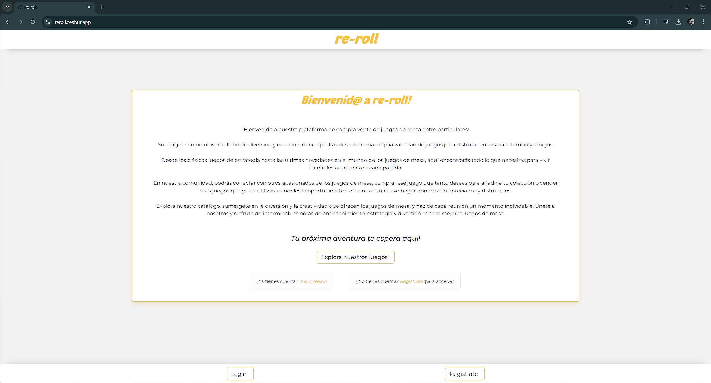  

Landing - Vista móvil

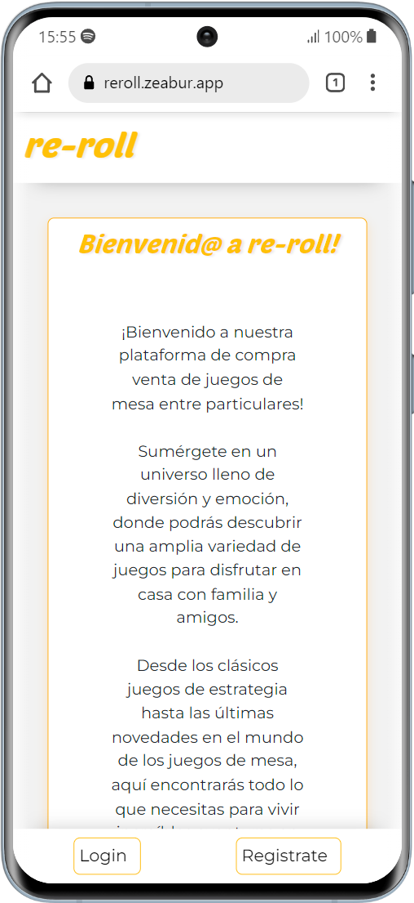  

Register


Register - Vista móvil

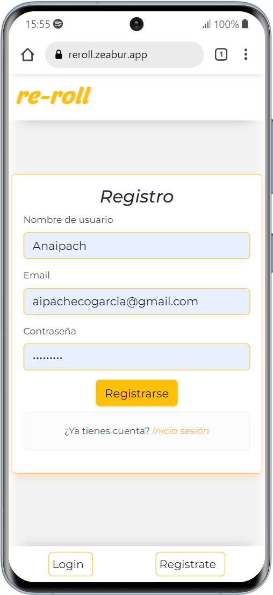


Login
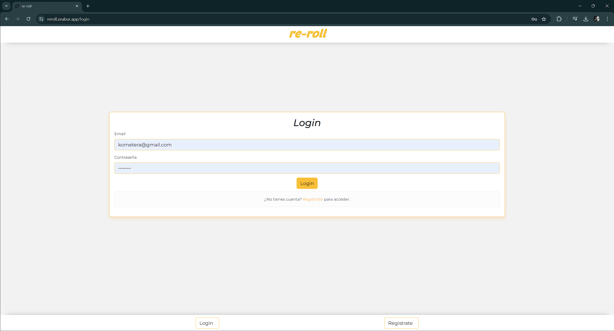

Login - Vista móvil

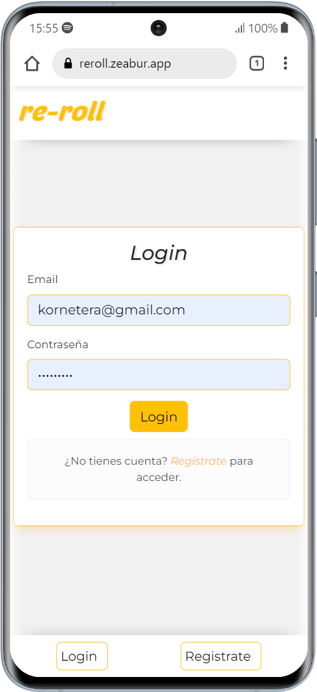

Perfil de usuario
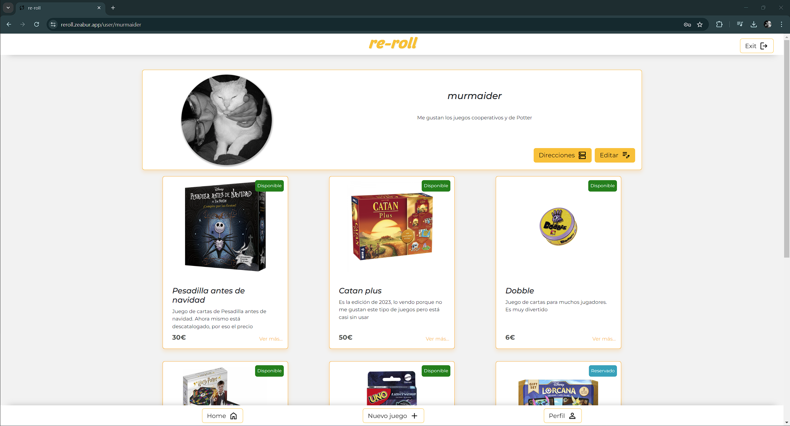

Perfil de usuario - Vista móvil

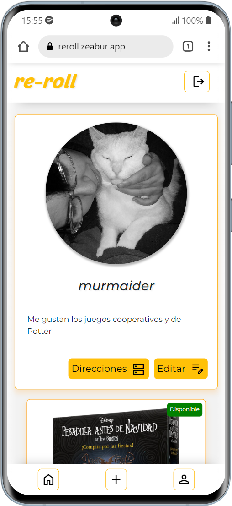

Vista detalle Juego
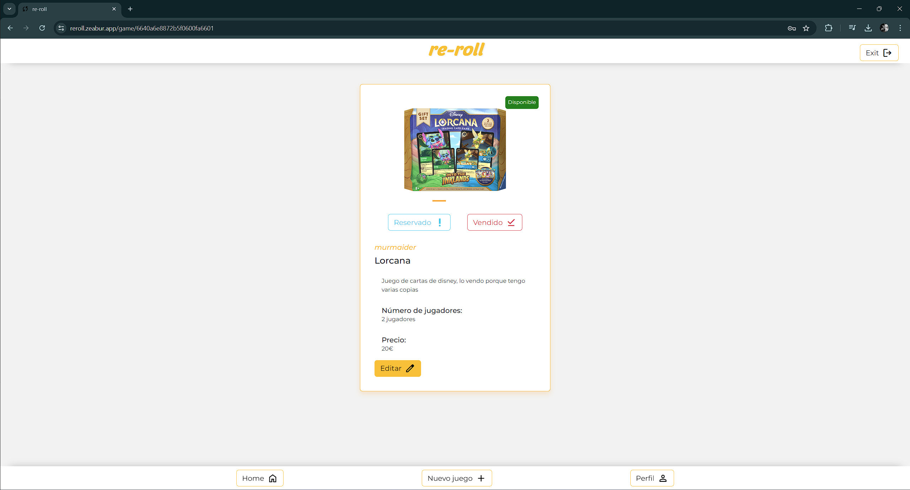


Vista detalle juego - Vista móvil

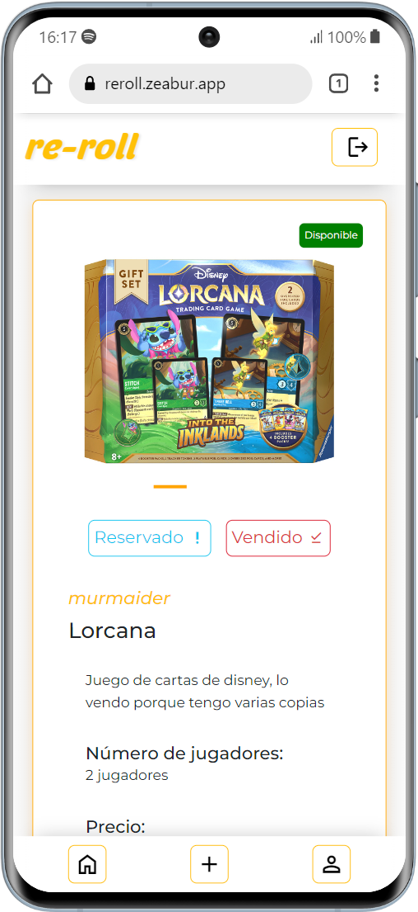

Crear anuncio


Crear anuncio - Vista móvil


Edición juego
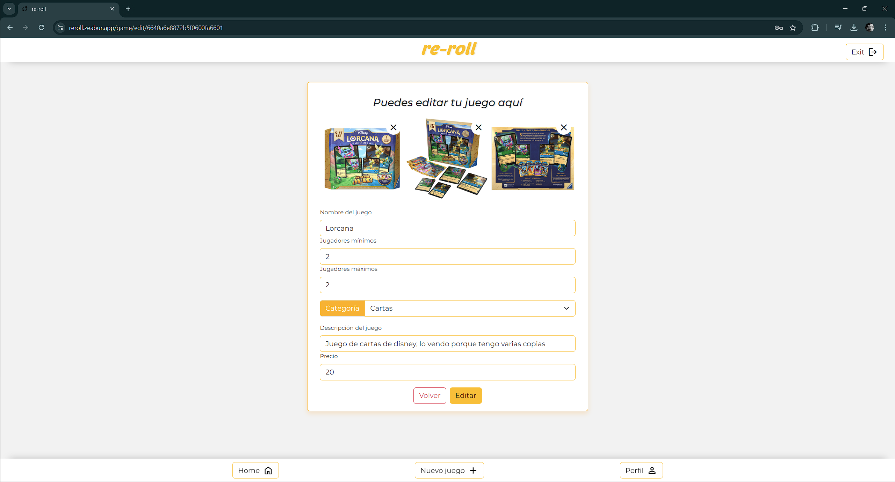

Edición juego - Vista móvil
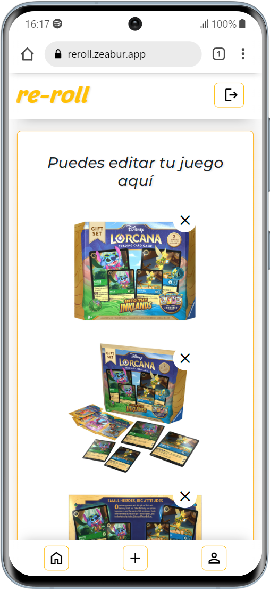

Crear dirección
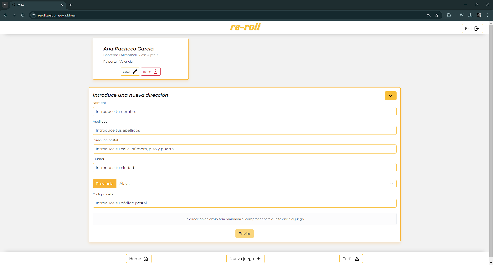

Crear dirección - Vista móvil

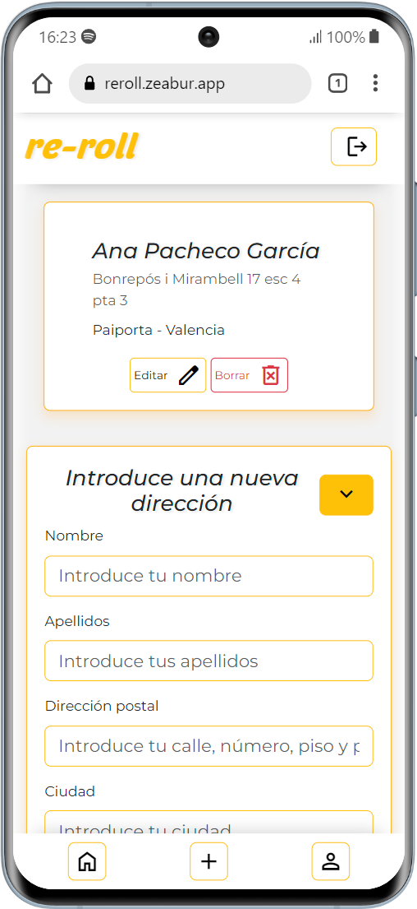

Edición dirección
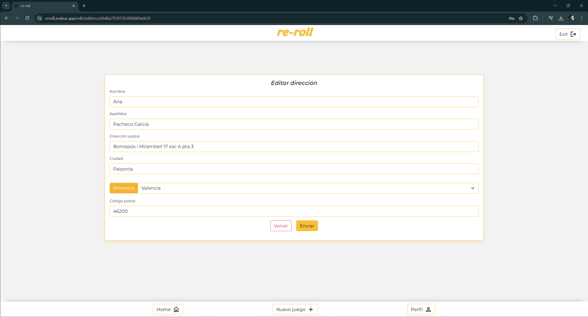

Edición dirección - Vista móvil

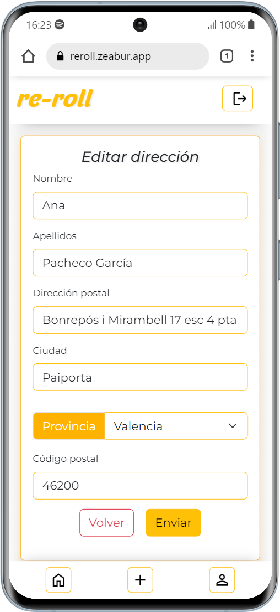

Página de confirmación de compra
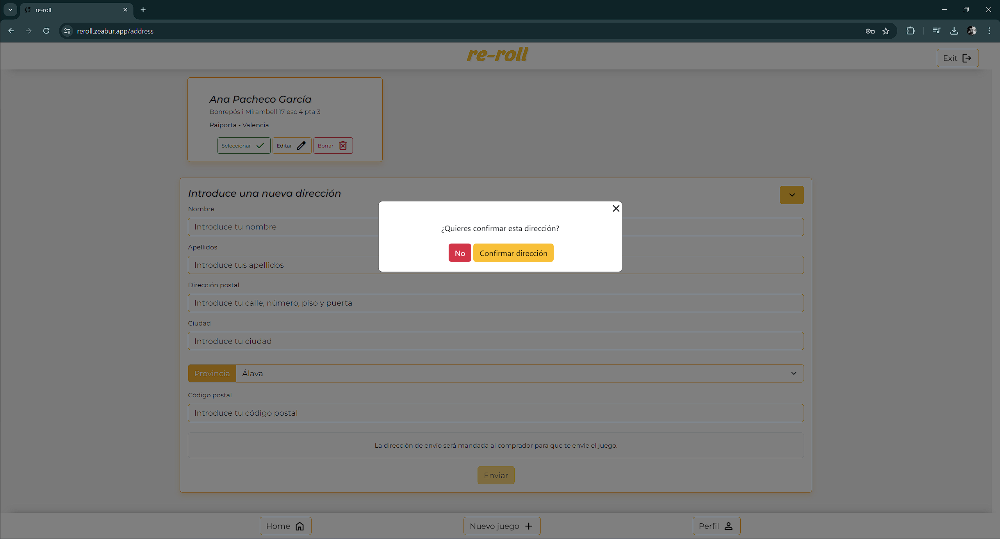

Página de confirmación de compra - Vista móvil


Confirmación de compra
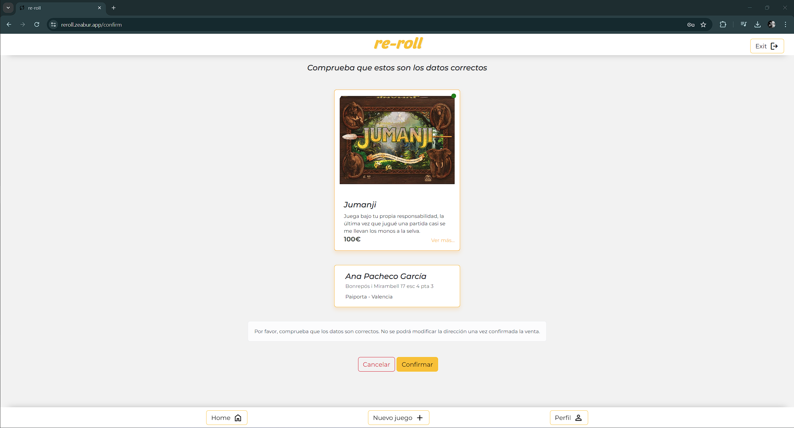

Confirmación de compra - Vista móvil


Admin
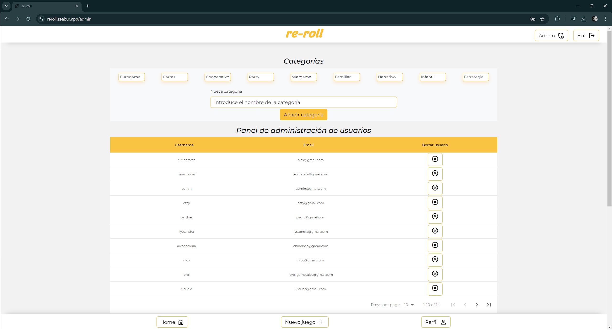

Admin - Más detalles
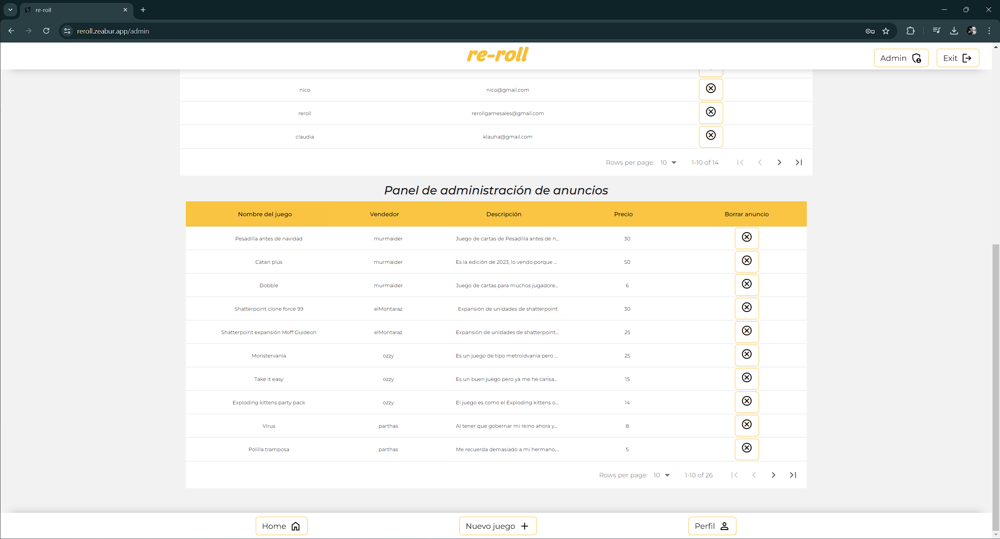


## Futuras funcionalidades
  
⬜ Historial de pedidos
⬜ Guardar anuncios de otros usuarios  
⬜ Mensajes entre usuarios


## Contribuciones
Las sugerencias y aportaciones son siempre bienvenidas.  

Puedes hacerlo de dos maneras:

1. Abriendo una issue
2. Crea un fork del repositorio
    - Crea una nueva rama  
        ```
        $ git checkout -b feature/nombreUsuario-mejora
        ```
    - Haz un commit con tus cambios 
        ```
        $ git commit -m 'feat: mejora X cosa'
        ```
    - Haz push a la rama 
        ```
        $ git push origin feature/nombreUsuario-mejora
        ```
    - Abre una solicitud de Pull Request


## Webgrafia:
Para conseguir mi objetivo he recopilado información y usado estas librerías:
- https://react-data-table-component.netlify.app/?path=/docs/getting-started-intro--docs
- https://mui.com/material-ui/material-icons/ y https://mui.com/
- https://github.com/motdotla/dotenv
- https://momentjs.com/
- https://reactstrap.github.io/?path=/story/home-installation--page
- 

## Contacto

<a href = "mailto:aipachecogarcia@gmail.com
"></a>
<a href="https://www.linkedin.com/in/anapachecogarcia/" target="_blank"></a>
</p>
